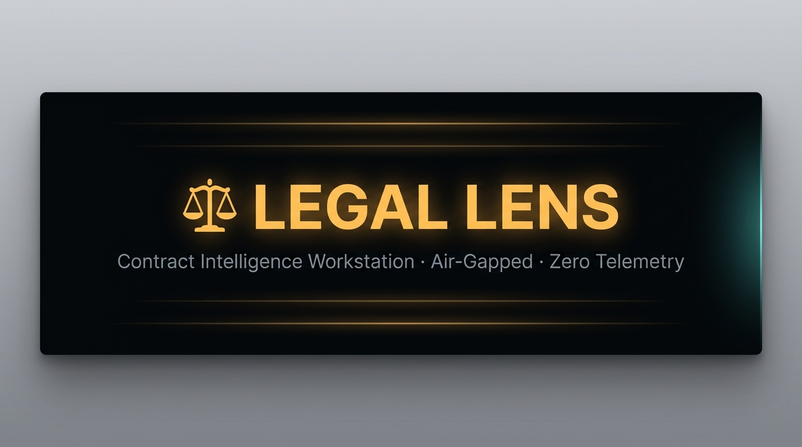

<div align="center">
  

  <br/>
  <br/>

  [](https://nextjs.org)
  [](https://www.typescriptlang.org)
  [](https://react.dev)
  [](./LICENSE)
  [](#-privacy-architecture)
  [](#-quick-start)

  <h3>Turn dense legal agreements into clear, grounded, and actionable intelligence.</h3>
  <p><strong>100% local · Zero external LLM calls · No telemetry · Deterministic analysis</strong></p>

  [Features](#-features) · [Architecture](#-architecture) · [Quick Start](#-quick-start) · [Tech Stack](#-tech-stack) · [Privacy](#-privacy-architecture) · [License](#-license)
</div>

---

## What Is Legal Lens?

Legal Lens is a **privacy-first contract intelligence workstation** built for legal teams, founders, and operators who need to deeply understand agreements without sending sensitive documents to external AI services.

Every insight is derived through **deterministic regex pattern matching** — grounded in actual document text, with no hallucination, no external API calls, and no cloud data transfers.

---

## ✨ Features

### 🔍 Forensic Contract Analysis
- **Document Type Classification** — Auto-detects MSAs, NDAs, EULAs, SOWs, Employment Agreements, SaaS Subscriptions, and Commercial Leases
- **Party & Jurisdiction Extraction** — Identifies contracting parties and governing law from natural text
- **Expanded Clause Taxonomy** — Covers 8+ risk categories:

| Category | What It Finds |
|---|---|
| `termination` | Notice periods, cause vs. convenience triggers, cure windows |
| `liability` | Caps, carve-outs, consequential damage exclusions |
| `ip_ownership` | Work-for-hire, IP assignment, moral rights waivers |
| `indemnification` | Indemnity scope, defense obligations, third-party claims |
| `non_compete_solicit` | Non-compete radius, duration, non-solicit scope |
| `warranties_disclaimers` | Warranty types, AS-IS disclaimers, fitness exclusions |
| `data_privacy_dpa` | GDPR, DPA obligations, data processing roles |
| `financial_payment` | Payment terms, late fees, auto-renewal pricing |

- **Weighted Risk Scorecard** — 0–100 risk index with critical / moderate / low breakdown
- **Negotiation Checklist** — Prioritized levers with suggested replacement language
- **Missing Protections Detector** — Flags absent industry-standard clauses (force majeure, audit rights, breach notice SLAs)

### 📖 Interactive Document Reader
- **Clause Risk Overlays** — Color-coded left borders (🔴 high / 🟡 medium / 🟢 low) on every section
- **Section Jump Navigation** — Click any insight card to instantly scroll & highlight its source clause
- **In-Reader Full-Text Search** — Highlighted match terms across all document sections
- **Private Clause Annotations** — Add reviewer notes to any section, persisted in localStorage
- **Copy Clause** — One-click copy of clause text to clipboard

### ⟷ Redline Comparison
- **Section-Level Diff Engine** — Matches clauses by number and title between any two uploaded drafts
- **Impact Categorization** — Classifies every change as Favorable / Unfavorable / Neutral
- **Side-by-Side Panels** — Prior draft vs. revised clause shown inline
- **Severity Filtering** — Filter by added / removed / modified and risk level
- **Export** — Download comparison reports as `.md`

### 🧠 Grounded Q&A Engine
- **Legal Synonym Expansion** — "cancel" → terminate, "pay" → fees/invoice, "court" → jurisdiction/arbitration
- **3-Tier Confidence System** — Every answer labeled `GROUNDED IN TEXT` · `SYNTHESIZED` · `NOT FOUND`
- **Source Citation** — Every answer links to the exact clause with line coordinates
- **Saved Research Repository** — Save Q&A sessions to localStorage for later review

### 📊 Portfolio Intelligence
- **Multi-Document Workspace** — Manage and switch between multiple agreements simultaneously
- **Risk Heatmap** — Visualizes high / medium / low risk distribution across all documents
- **Renewal Calendar** — Tracks auto-renewal notice deadlines for every document

### 📋 Actionable One-Click Outputs *(all downloadable as `.md`)*
- 📋 One-Page Executive Summary
- ⚖️ Questions for Legal Counsel
- 🤝 Pre-Signature Negotiation Checklist
- 📅 Obligations & Milestones Timeline
- ✅ Pre-Signing Checklist
- 🗓 Key Dates & Renewal Calendar

---

## 🏗 Architecture

```
legal-lens/
│
├── pages/                          # Next.js Pages Router
│   ├── index.tsx                   # Main workspace — analysis + reader split view
│   ├── compare.tsx                 # Redline comparison workbench
│   ├── documents.tsx               # Agreement portfolio + risk heatmap
│   ├── saved-questions.tsx         # Q&A research repository
│   ├── help.tsx                    # Methodology & transparency
│   └── api/
│       ├── analyze.ts              # Grounded Q&A endpoint
│       ├── compare.ts              # Clause diff endpoint
│       ├── documents/index.ts      # Document list + upload
│       └── documents/[id].ts       # Document CRUD
│
├── src/
│   ├── components/
│   │   └── AppShell.tsx            # Sidebar nav + mobile dock shell
│   │
│   ├── services/
│   │   ├── analyzer.ts             # ★ Core clause extraction & risk scoring
│   │   ├── comparator.ts           # Section-level diff engine
│   │   ├── qaEngine.ts             # Grounded Q&A with synonym expansion
│   │   ├── documentParser.ts       # PDF / DOCX / TXT text extraction
│   │   ├── documentStore.ts        # In-memory + file-based persistence
│   │   └── exports.ts              # Markdown / CSV export builders
│   │
│   ├── styles/
│   │   └── globals.css             # Obsidian & Burnished Aurum design system
│   │
│   └── types/
│       └── index.ts                # Full TypeScript type definitions
│
├── tests/
│   └── services.test.js            # Node:test unit tests for all services
│
├── public/                         # Static assets
├── .env.example                    # Environment variable reference
├── Dockerfile                      # Production container
└── vercel.json                     # Vercel deployment config
```

### Data Flow

```
Upload (.pdf/.docx/.txt)
        │
        ▼
documentParser.ts  ──► Extracts raw text + page count
        │
        ▼
documentStore.ts   ──► Persists DocumentMeta to /data/ (local JSON)
        │
        ▼
analyzer.ts        ──► extractSections() → ParsedSection[]
                       generateInsights() → DocumentInsight[]
                       buildScorecard()   → RiskScorecard
                       buildChecklist()   → NegotiationLever[]
        │
        ▼
pages/index.tsx    ──► Renders split-view: Analysis Column + Document Reader
```

---

## 🚀 Quick Start

### Prerequisites
- **Node.js** ≥ 18
- **npm** ≥ 9

### Install & Run

```bash
# 1. Clone
git clone https://github.com/your-username/legal-lens.git
cd legal-lens

# 2. Install dependencies
npm install

# 3. Configure environment
cp .env.example .env.local

# 4. Start development server
npm run dev
```

Open **http://localhost:3000** and upload any `.pdf`, `.docx`, or `.txt` contract.

### Production

```bash
npm run build    # Compile & optimize
npm start        # Start production server
```

### Docker

```bash
# Build image
docker build -t legal-lens .

# Run with persistent local data volume
docker run -p 3000:3000 -v $(pwd)/data:/app/data legal-lens
```

### Deploy to Vercel

```bash
npx vercel --prod
```

A `vercel.json` is already included with optimal settings.

---

## 🛠 Tech Stack

| Layer | Technology |
|---|---|
| **Framework** | Next.js 14 (Pages Router) |
| **Language** | TypeScript 5.5 — strict mode |
| **UI** | React 18 — zero UI library dependencies |
| **Styling** | Vanilla CSS — Obsidian & Burnished Aurum design system |
| **PDF Parsing** | `pdf-parse` |
| **DOCX Parsing** | `mammoth` |
| **Persistence** | Local filesystem JSON (zero-DB architecture) |
| **Testing** | Node.js built-in `node:test` runner |
| **Deployment** | Vercel / Docker / Self-hosted |

---

## 🔐 Privacy Architecture

Legal Lens is built on a **zero-trust, air-gapped model**:

| Property | Status |
|---|---|
| External LLM API calls | ❌ None — all analysis is local deterministic logic |
| Third-party analytics | ❌ None — no Segment, Mixpanel, GA, or similar |
| Cloud document storage | ❌ None — documents stored locally in `/data/` |
| Network requests on analysis | ❌ None — fully offline capable after `npm install` |
| Font loading | ⚠️ Google Fonts CDN (optional, replaceable with local fonts) |

Documents never leave your machine. Analysis is performed entirely through **regex pattern matching and rule-based scoring** on the server that hosts the app.

---

## 📄 Supported File Formats

| Format | Parser | Text Quality | Full Analysis |
|---|---|---|---|
| `.txt` | Native | ★★★★★ | ✅ |
| `.pdf` | pdf-parse | ★★★★☆ | ✅ |
| `.docx` | mammoth | ★★★★★ | ✅ |
| `.doc` | Demo fallback | ★★☆☆☆ | ⚠️ Limited |

---

## 🧪 Testing

```bash
# Run full test suite (TypeScript compile + Node:test runner)
npm test

# TypeScript type checking only
npm run typecheck
```

Tests cover clause extraction, risk scoring, section parsing, and Q&A grounding across all service modules.

---

## ⚙️ Environment Variables

| Variable | Default | Description |
|---|---|---|
| `DATA_DIR` | `./data` | Directory for local document JSON storage |
| `NEXT_PUBLIC_APP_URL` | `http://localhost:3000` | Used in Open Graph meta tags |
| `NODE_ENV` | `development` | Node environment |

Copy `.env.example` → `.env.local` and update as needed.

---

## 📁 Project Structure Conventions

- **Services** (`src/services/`) — Pure TypeScript business logic, no React imports, fully unit-testable
- **Pages** (`pages/`) — Thin orchestration layer; all heavy logic delegated to services
- **Types** (`src/types/index.ts`) — Single source of truth for all interfaces and union types
- **CSS** (`src/styles/globals.css`) — All styling via CSS custom properties; no inline style objects for theming

---

## ⚖ Legal Disclaimer

Legal Lens provides **informational analysis and comprehension support only** — it does not constitute legal advice, legal representation, or formal legal opinions on enforceability under any statutory regime.

For binding agreements, regulatory compliance, contentious disputes, or decisions affecting legal rights and obligations, **always consult a qualified attorney licensed in your jurisdiction.**

---

## 📝 License

MIT License © 2024

Permission is hereby granted, free of charge, to any person obtaining a copy of this software and associated documentation files (the "Software"), to deal in the Software without restriction, including without limitation the rights to use, copy, modify, merge, publish, distribute, sublicense, and/or sell copies of the Software.

---

<div align="center">
  <sub>Built with precision for legal professionals who demand transparency.</sub><br/>
  <sub><strong>⚖ Legal Lens</strong> · Obsidian & Burnished Aurum · Air-Gapped Contract Intelligence</sub>
</div>
